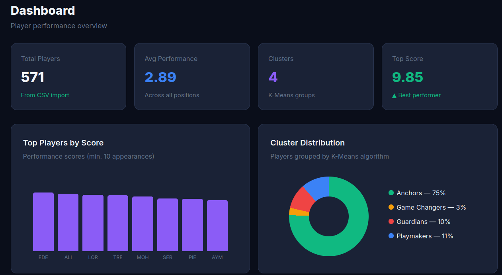
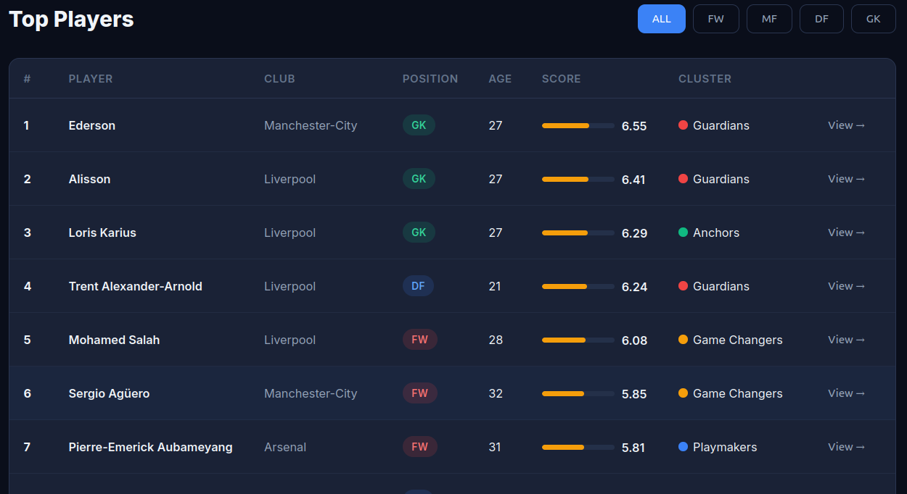
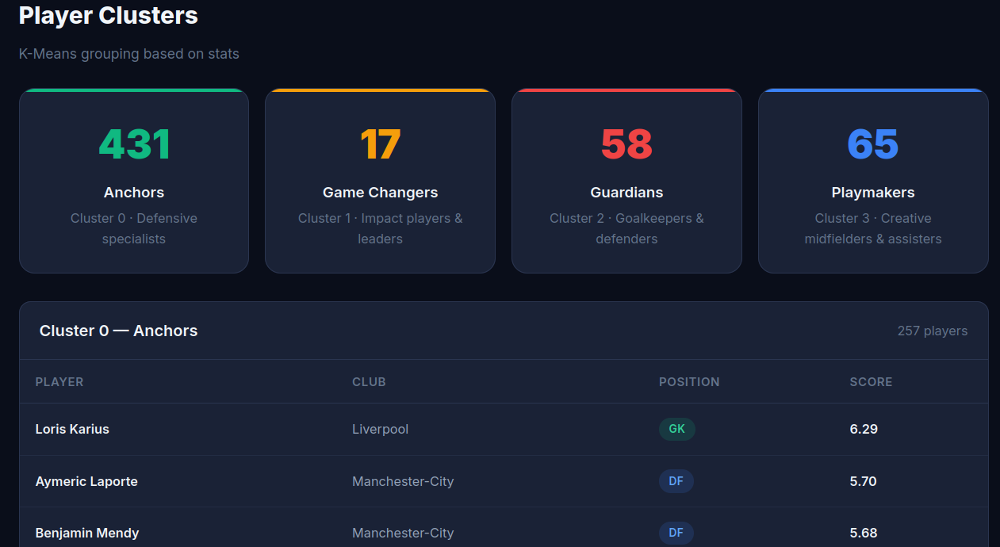
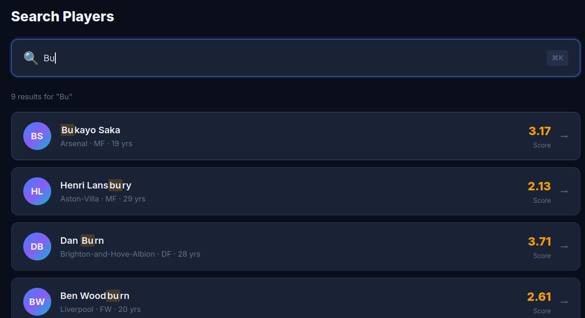

# ⚽ Football Player Performance Analysis & Prediction System


> A full-stack information system for analysing and predicting football player performance using machine learning methods — built as a university diploma project and backend portfolio piece.

The system ingests real player statistics, applies **linear regression** to compute performance scores, groups players into positional clusters via **K-Means**, and exposes the results through a clean REST API consumed by a React dashboard.

---

## Table of Contents

- [Key Features](#key-features)
- [Tech Stack](#tech-stack)
- [Architecture Overview](#architecture-overview)
- [Machine Learning & Analytical Logic](#machine-learning--analytical-logic)
- [Backend API Overview](#backend-api-overview)
- [Frontend Overview](#frontend-overview)
- [Database & Data Import](#database--data-import)
- [How to Run Locally](#how-to-run-locally)
- [Project Structure](#project-structure)
- [Screenshots](#screenshots)
- [What I Learned](#what-i-learned)
- [Future Improvements](#future-improvements)
- [Author](#author)

---

## Key Features

- **Performance Scoring** — Position-aware scoring system that evaluates each player using metrics relevant to their role (goals/assists for forwards, tackles/interceptions for defenders, etc.).
- **Linear Regression Prediction** — Trained per-position regression models predict a player's performance score from their statistical profile.
- **K-Means Clustering** — Players are automatically grouped into role-based clusters, surfacing natural archetypes within each position.
- **Strategy Pattern for Scoring** — A clean OOP design using the Strategy pattern makes it straightforward to extend or modify scoring logic for any position without touching shared code.
- **REST API** — Well-structured Spring Boot API serves dashboard statistics, top performers, positional filters, cluster data, and full-text search.
- **React Dashboard** — Interactive single-page application presenting analytics visually, with routing, search, and cluster visualisation pages.
- **CSV Data Import** — Real player data from `players.csv` is loaded and managed via Liquibase database migrations, ensuring a reproducible setup.

---

## Tech Stack

| Layer | Technology |
|---|---|
| **Backend Language** | Java 17 |
| **Backend Framework** | Spring Boot 3, Spring Web (REST), Spring Data JPA |
| **Database** | MySQL 8, Liquibase (migrations) |
| **ML / Statistics** | Apache Commons Math 3 (OLS linear regression, K-Means clustering) |
| **Build Tool** | Apache Maven |
| **Utilities** | Lombok, MapStruct-style manual mappers, DTO pattern |
| **Frontend Framework** | React 18 + Vite |
| **Frontend Libraries** | React Router, Axios |
| **Styling** | CSS Modules / plain CSS |

---

## Architecture Overview

The backend follows a classic **layered architecture**:

```
HTTP Request
    │
    ▼
┌─────────────────┐
│   Controller    │  ← REST endpoints, request/response mapping
└────────┬────────┘
         │
┌────────▼────────┐
│    Service      │  ← Business logic, ML orchestration
└────────┬────────┘
         │
┌────────▼────────┐
│   Repository    │  ← Spring Data JPA, MySQL queries
└────────┬────────┘
         │
┌────────▼────────┐
│  Entity / DTO   │  ← JPA entities, response DTOs, mappers
└─────────────────┘

Cross-cutting:
  ├── Strategy   (position-based scoring strategies)
  └── Trainer    (position-specific regression training)
```

The frontend is a standard React SPA that communicates exclusively with the backend via Axios HTTP calls to the REST API.

---

## Machine Learning & Analytical Logic

### Linear Regression — Performance Prediction

Each player position (Goalkeeper, Defender, Midfielder, Forward) has a dedicated **Trainer** class that fits an Ordinary Least Squares (OLS) regression model using **Apache Commons Math** (`OLSMultipleLinearRegression`). The model is trained on position-relevant statistical features and produces a continuous performance score for each player.

```
Features (position-specific stats) ──► OLS Regression ──► Performance Score
```

### K-Means Clustering — Role Discovery

After scoring, players are grouped into clusters using a **K-Means** algorithm (also from Apache Commons Math). This surfaces natural positional archetypes — for example, distinguishing box-to-box midfielders from deep-lying playmakers — without manual labelling.

### Strategy Pattern — Position-Based Scoring

Scoring logic is encapsulated in a set of **Strategy** classes, one per position. A `ScoringStrategy` interface defines the contract; each concrete strategy selects the relevant metrics and weights for its position. The service layer resolves the correct strategy at runtime, keeping the scoring pipeline open for extension and closed for modification.

```java
// Conceptual example
ScoringStrategy strategy = strategyFactory.getStrategy(player.getPosition());
double score = strategy.calculate(player.getStats());
```

### Trainer Classes

Alongside the scoring strategies, **Trainer** classes handle the position-specific regression training lifecycle: assembling the training matrix, fitting the model, and exposing a `predict(stats)` method used during score computation.

---

## Backend API Overview

Base path: `http://localhost:8080/api`

| Method | Endpoint | Description |
|--------|----------|-------------|
| `GET` | `/dashboard` | Summary statistics: total players, average score, top score, cluster distribution, top performers |
| `GET` | `/players` | Paginated list of all players |
| `GET` | `/players/{id}` | Single player detail with stats and score |
| `GET` | `/players/top` | Top N players by performance score |
| `GET` | `/players/search?q=` | Full-text player search by name |
| `GET` | `/players/position?pos=` | Filter players by position |
| `GET` | `/clusters` | All cluster groups with their assigned players |
| `GET` | `/clusters/{id}` | Players belonging to a specific cluster |

> **Note:** Exact endpoint paths may vary slightly — refer to the controller classes in `/src` for the authoritative routes.

---

## Frontend Overview

The React + Vite frontend is a single-page application with client-side routing via **React Router**.

| Page | Route | Description |
|------|-------|-------------|
| **Dashboard** | `/` | KPI cards (total players, avg score, top score), cluster distribution, top performers table |
| **Players** | `/players` | Full player list with position filter |
| **Search** | `/search` | Live search by player name |
| **Clusters** | `/clusters` | K-Means cluster groups and their members |
| **Top Players** | `/top` | Ranked leaderboard of highest-scoring players |

All data is fetched from the backend API using **Axios**. The application is configured through `client/package.json` and `vite.config.js`, with a dev proxy pointing to the Spring Boot server.

---

## Database & Data Import

- **MySQL 8** is the primary relational database. The schema covers three main entities: `Player`, `PlayerStats`, and `Team`.
- **Liquibase** manages all schema migrations and initial data seeding, ensuring the database state is always reproducible across environments.
- **`players.csv`** (located in the project root) contains the raw player dataset. On first startup (or via a dedicated import mechanism), this data is parsed, validated, and persisted to the database, after which the ML models are trained.

To set up the database, create a MySQL schema (e.g. `diploma_db`) and configure the connection in `src/main/resources/application.properties` before running the backend.

---

## How to Run Locally

### Prerequisites

- Java 17 (JDK)
- Apache Maven 3.8+
- MySQL 8.x (running locally or via Docker)
- Node.js 18+ and npm

---

### 1. Database Setup

```sql
CREATE DATABASE diploma_db CHARACTER SET utf8mb4 COLLATE utf8mb4_unicode_ci;
```

### 2. Backend Configuration

Edit `src/main/resources/application.properties`:

```properties
spring.datasource.url=jdbc:mysql://localhost:3306/diploma_db
spring.datasource.username=YOUR_MYSQL_USER
spring.datasource.password=YOUR_MYSQL_PASSWORD
spring.jpa.hibernate.ddl-auto=validate
spring.liquibase.enabled=true
```

### 3. Run the Backend

```bash
# From the project root
./mvnw clean install
./mvnw spring-boot:run
```

The API will be available at `http://localhost:8080`.

### 4. Run the Frontend

```bash
cd client
npm install
npm run dev
```

The React app will be available at `http://localhost:5173`.

---

## Project Structure

```
project-diploma/
├── src/
│   └── main/
│       ├── java/
│       │   └── com/example/diploma/
│       │       ├── controller/       # REST controllers
│       │       ├── service/          # Business & ML logic
│       │       ├── repository/       # Spring Data JPA repositories
│       │       ├── entity/           # JPA entities (Player, PlayerStats, Team)
│       │       ├── dto/              # Request/response DTOs
│       │       ├── mapper/           # Entity ↔ DTO mappers
│       │       ├── strategy/         # Position-based scoring strategies
│       │       └── trainer/          # Per-position regression trainers
│       └── resources/
│           ├── application.properties
│           └── db/changelog/         # Liquibase migration files
├── client/                           # React + Vite frontend
│   ├── src/
│   │   ├── pages/                    # Dashboard, Players, Search, Clusters, TopPlayers
│   │   ├── components/               # Shared UI components
│   │   └── api/                      # Axios API client
│   ├── package.json
│   └── vite.config.js
├── players.csv                       # Source dataset
├── pom.xml                           # Maven build configuration
└── README.md
```

---

## Screenshots

> Add screenshots to `docs/screenshots/` after running the project locally.

**Dashboard**


**Top Players**


**Cluster View**


**Search**


---

## What I Learned

- **Spring Boot layered architecture** — Organising a non-trivial backend into controller / service / repository / entity / DTO layers with clean separation of concerns.
- **Design Patterns in practice** — Applying the **Strategy Pattern** to a real problem (position-aware scoring) rather than a textbook example, making the codebase genuinely extensible.
- **Applied ML without a dedicated ML framework** — Implementing OLS linear regression and K-Means clustering using Apache Commons Math within a standard Java/Spring application.
- **Database migrations with Liquibase** — Managing schema evolution and data seeding in a repeatable, version-controlled way.
- **Full-stack integration** — Connecting a React SPA to a Spring Boot API, handling CORS, Axios configuration, and client-side routing.
- **Data engineering basics** — Parsing, cleaning, and importing CSV data into a relational schema.

---

## Future Improvements

- **Authentication & authorisation** — Add Spring Security with JWT so the system can support multiple users or roles (e.g., analyst vs. read-only viewer).
- **Model persistence** — Serialise trained regression models to disk so they do not need to be retrained on every application restart.
- **More sophisticated ML** — Explore Random Forest or Gradient Boosting (via a Python microservice or ONNX model) for potentially higher prediction accuracy.
- **Interactive charts** — Integrate a charting library (e.g., Recharts or Chart.js) on the frontend for richer visualisation of cluster distributions and performance trends.
- **REST API documentation** — Add Springdoc / Swagger UI for auto-generated, interactive API docs.
- **Docker Compose** — Containerise the backend and database for a one-command local setup.
- **Unit & integration tests** — Expand test coverage with JUnit 5 and Mockito for the service and strategy layers.

---

## Author

**Vardan Khachatryan**
Java Backend Developer

- GitHub: [@vardan2112001](https://github.com/vardan2112001)

---

*This project was developed as a university diploma thesis and is maintained as a portfolio demonstration of backend engineering and applied machine learning in Java.*