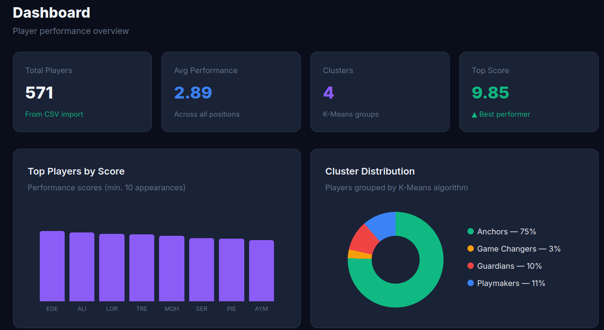
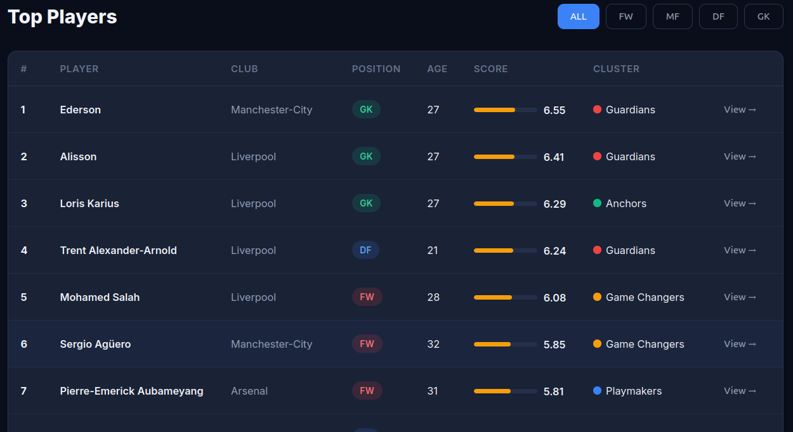
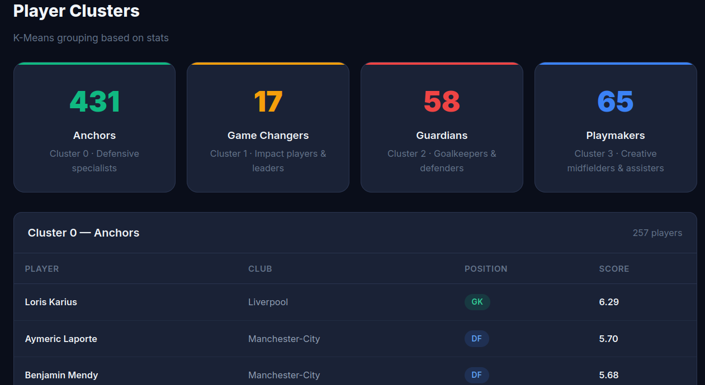
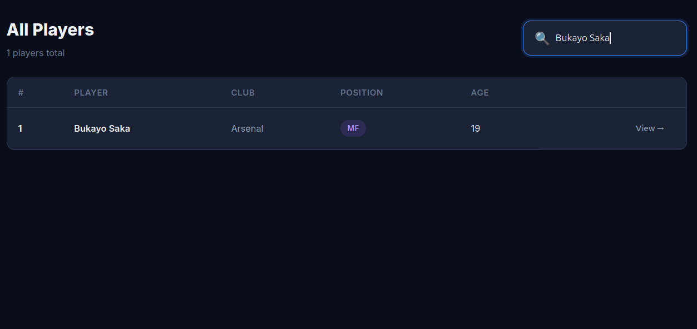

# ⚽ Football Player Performance Analysis & Prediction System


> A full-stack information system for analysing and predicting football player performance using machine learning methods — built as a university diploma project and backend portfolio piece.

The system ingests real player statistics, applies **linear regression** to compute performance scores, groups players into positional clusters via **K-Means**, and exposes the results through a clean REST API consumed by a React dashboard.

---

## Table of Contents

- [Key Features](#key-features)
- [Tech Stack](#tech-stack)
- [Architecture Overview](#architecture-overview)
- [Machine Learning & Analytical Logic](#machine-learning--analytical-logic)
- [Backend API Overview](#backend-api-overview)
- [Frontend Overview](#frontend-overview)
- [Database & Data Import](#database--data-import)
- [🐳 Running with Docker (Recommended)](#-running-with-docker-recommended)
- [How to Run Locally (Without Docker)](#how-to-run-locally-without-docker)
- [Project Structure](#project-structure)
- [Screenshots](#screenshots)
- [What I Learned](#what-i-learned)
- [Future Improvements](#future-improvements)
- [Author](#author)

---

## Key Features

- **Performance Scoring** — Position-aware scoring system that evaluates each player using metrics relevant to their role (goals/assists for forwards, tackles/interceptions for defenders, etc.).
- **Linear Regression Prediction** — Trained per-position regression models predict a player's performance score from their statistical profile.
- **K-Means Clustering** — Players are automatically grouped into role-based clusters, surfacing natural archetypes within each position.
- **Strategy Pattern for Scoring** — A clean OOP design using the Strategy pattern makes it straightforward to extend or modify scoring logic for any position without touching shared code.
- **REST API** — Well-structured Spring Boot API serves dashboard statistics, top performers, positional filters, cluster data, and full-text search.
- **React Dashboard** — Interactive single-page application presenting analytics visually, with routing, search, and cluster visualisation pages.
- **CSV Data Import** — Real player data from `players.csv` is loaded and managed via Liquibase database migrations, ensuring a reproducible setup.
- **Docker Support** — Full containerisation with Docker Compose for a one-command setup of the entire stack.

---

## Tech Stack

| Layer | Technology |
|---|---|
| **Backend Language** | Java 17 |
| **Backend Framework** | Spring Boot 3, Spring Web (REST), Spring Data JPA |
| **Database** | MySQL 8, Liquibase (migrations) |
| **ML / Statistics** | Apache Commons Math 3 (OLS linear regression, K-Means clustering) |
| **Build Tool** | Apache Maven |
| **Utilities** | Lombok, manual mappers, DTO pattern |
| **Frontend Framework** | React 19 + Vite 8 |
| **Frontend Libraries** | React Router 7, Axios |
| **Styling** | Plain CSS |
| **Containerisation** | Docker, Docker Compose, nginx |

---

## Architecture Overview

The backend follows a classic **layered architecture**:

```
HTTP Request
    │
    ▼
┌─────────────────┐
│   Controller    │  ← REST endpoints, request/response mapping
└────────┬────────┘
         │
┌────────▼────────┐
│    Service      │  ← Business logic, ML orchestration
└────────┬────────┘
         │
┌────────▼────────┐
│   Repository    │  ← Spring Data JPA, MySQL queries
└────────┬────────┘
         │
┌────────▼────────┐
│  Entity / DTO   │  ← JPA entities, response DTOs, mappers
└─────────────────┘

Cross-cutting:
  ├── Strategy   (position-based scoring strategies)
  └── Trainer    (position-specific regression training)
```

The frontend is a standard React SPA that communicates exclusively with the backend via Axios HTTP calls to the REST API.

---

## Machine Learning & Analytical Logic

### Linear Regression — Performance Prediction

Each player position (Goalkeeper, Defender, Midfielder, Forward) has a dedicated **Trainer** class that fits an Ordinary Least Squares (OLS) regression model using **Apache Commons Math** (`OLSMultipleLinearRegression`). The model is trained on position-relevant statistical features and produces a continuous performance score for each player.

```
Features (position-specific stats) ──► OLS Regression ──► Performance Score
```

### K-Means Clustering — Role Discovery

After scoring, players are grouped into clusters using a **K-Means** algorithm (also from Apache Commons Math). This surfaces natural positional archetypes — for example, distinguishing box-to-box midfielders from deep-lying playmakers — without manual labelling.

### Strategy Pattern — Position-Based Scoring

Scoring logic is encapsulated in a set of **Strategy** classes, one per position. A `ScoringStrategy` interface defines the contract; each concrete strategy selects the relevant metrics and weights for its position. The service layer resolves the correct strategy at runtime, keeping the scoring pipeline open for extension and closed for modification.

```java
// Conceptual example
ScoringStrategy strategy = strategyFactory.getStrategy(player.getPosition());
double score = strategy.calculate(player.getStats());
```

### Trainer Classes

Alongside the scoring strategies, **Trainer** classes handle the position-specific regression training lifecycle: assembling the training matrix, fitting the model, and exposing a `predict(stats)` method used during score computation.

---

## Backend API Overview

Base path: `http://localhost:8080/api`

| Method | Endpoint | Description |
|--------|----------|-------------|
| `GET` | `/dashboard` | Summary statistics: total players, average score, top score |
| `GET` | `/dashboard/clusters` | Cluster distribution counts |
| `GET` | `/players` | Paginated list of all players |
| `GET` | `/players/{id}` | Single player detail with stats and score |
| `GET` | `/players/top` | Top N players by performance score |
| `GET` | `/players/search?name=` | Player search by name |
| `GET` | `/players/position?position=` | Filter players by position with pagination |
| `GET` | `/players/role/{clusterId}` | Players belonging to a specific cluster |

---

## Frontend Overview

The React + Vite frontend is a single-page application with client-side routing via **React Router**.

| Page | Route | Description |
|------|-------|-------------|
| **Dashboard** | `/` | KPI cards (total players, avg score, top score), cluster distribution, top performers |
| **Top Players** | `/top-players` | Ranked leaderboard with position filter |
| **All Players** | `/players` | Full player list with search and pagination |
| **Clusters** | `/clusters` | K-Means cluster groups and their members |
| **Player Detail** | `/players/:id` | Individual player stats and performance score |

---

## Database & Data Import

- **MySQL 8** is the primary relational database. The schema covers three main entities: `Player`, `PlayerStats`, and `Team`.
- **Liquibase** manages all schema migrations, ensuring the database state is always reproducible across environments.
- **`players.csv`** contains the raw Premier League player dataset (571 players, 48 statistical columns). On first startup this data is automatically parsed, persisted to the database, and the ML pipeline runs immediately — no manual steps needed.

---

## 🐳 Running with Docker (Recommended)

Docker is the fastest and most reliable way to run the entire stack. A single command starts MySQL, the Spring Boot backend, and the React frontend — no need to install Java, Maven, Node.js, or MySQL locally.

### Prerequisites

- [Docker Desktop](https://www.docker.com/products/docker-desktop/) (Mac / Windows) or Docker Engine + Docker Compose plugin (Linux)
- That's it.

---

### Step 1 — Clone the repository

```bash
git clone https://github.com/vardan2112001/player-analysis.git
cd player-analysis
```

### Step 2 — Create your environment file

```bash
cp .env.example .env
```

Open `.env` and set your passwords (or leave the defaults for local testing):

```env
MYSQL_ROOT_PASSWORD=rootpassword123
MYSQL_DATABASE=player_analyzer
MYSQL_USER=player_app
MYSQL_PASSWORD=apppassword456
SPRING_PROFILES_ACTIVE=prod
```

> ⚠️ Never commit the `.env` file to git. It's already in `.gitignore`.

### Step 3 — Make sure players.csv is in the server folder

```bash
# If players.csv is only at the project root, copy it:
cp players.csv server/players.csv
```

### Step 4 — Build and start everything

```bash
docker compose up --build
```

This single command will:
1. Pull MySQL 8.0 image
2. Build the Spring Boot backend (Maven multi-stage build inside Docker)
3. Build the React frontend (npm build + nginx)
4. Start all three containers in the correct order
5. Run Liquibase migrations automatically
6. Seed the database from `players.csv`
7. Train the regression and K-Means models

**First build takes ~3–5 minutes** (Maven downloads dependencies). Subsequent builds are fast due to Docker layer caching.

### Step 5 — Open the app

| Service | URL |
|---------|-----|
| **Frontend (React app)** | http://localhost |
| **Backend API** | http://localhost:8080/api |
| **Dashboard endpoint** | http://localhost:8080/api/dashboard |

---

### Useful Docker commands

```bash
# Run in background (detached mode)
docker compose up --build -d

# Watch logs from all containers
docker compose logs -f

# Watch only backend logs
docker compose logs -f backend

# Check container status and health
docker compose ps

# Stop all containers (keeps database data)
docker compose down

# Stop and DELETE all data (full reset)
docker compose down -v

# Rebuild only one service after a code change
docker compose up --build backend
```

---

### How the containers connect

```
Your Browser
     │
     │  http://localhost:80
     ▼
┌──────────────────────────────────┐
│  frontend (nginx :80)            │
│                                  │
│  /           → React SPA files   │
│  /api/*      → proxy → backend   │
└─────────────────┬────────────────┘
                  │  internal Docker network
                  │  http://backend:8080/api/*
                  ▼
┌──────────────────────────────────┐
│  backend (Spring Boot :8080)     │
│                                  │
│  Reads  /app/data/players.csv    │
│  Connects to  db:3306            │
└─────────────────┬────────────────┘
                  │  internal Docker network
                  │  jdbc:mysql://db:3306/...
                  ▼
┌──────────────────────────────────┐
│  db (MySQL 8.0 :3306)            │
│  Data persisted in named volume  │
└──────────────────────────────────┘
```

The database and backend ports are bound to `127.0.0.1` only — they are not accessible from outside the machine. Only the frontend (port 80) is public-facing.

---

### Troubleshooting Docker

**Backend crashes on startup with "Communications link failure"**
MySQL wasn't ready in time. Just restart the backend:
```bash
docker compose restart backend
```

**App loads but shows no players / empty dashboard**
The CSV wasn't found at startup. Verify:
```bash
docker compose exec backend ls /app/data/
# Should show: players.csv
docker compose logs backend | grep -i "csv\|seed\|import"
```

**Port 80 already in use**
Something else is using port 80. Change the frontend port in `docker-compose.yml`:
```yaml
ports:
  - "8090:80"   # app will be at http://localhost:8090
```

**Full reset (database schema issues)**
```bash
docker compose down -v   # deletes the MySQL volume
docker compose up --build
```

---

## How to Run Locally (Without Docker)

### Prerequisites

- Java 17 (JDK)
- Apache Maven 3.8+
- MySQL 8.x (running locally)
- Node.js 18+ and npm

### 1. Database Setup

```sql
CREATE DATABASE player_analyzer CHARACTER SET utf8mb4 COLLATE utf8mb4_unicode_ci;
```

### 2. Backend Configuration

Edit `server/src/main/resources/application.yaml`:

```yaml
spring:
  datasource:
    url: jdbc:mysql://localhost:3306/player_analyzer?createDatabaseIfNotExist=true
    username: YOUR_MYSQL_USER
    password: YOUR_MYSQL_PASSWORD

app:
  import:
    file:
      path: /absolute/path/to/players.csv
```

### 3. Run the Backend

```bash
cd server
./mvnw clean spring-boot:run
```

The API will be available at `http://localhost:8080`.

### 4. Run the Frontend

```bash
cd client
npm install
npm run dev
```

The React app will be available at `http://localhost:5173`.

---

## Project Structure

```
player-analysis/
├── server/                           # Spring Boot backend
│   ├── src/main/java/com/project/
│   │   ├── controller/               # REST controllers
│   │   ├── service/                  # Business & ML logic
│   │   │   └── impl/                 # Service implementations
│   │   ├── repository/               # Spring Data JPA repositories
│   │   ├── entity/                   # JPA entities (Player, PlayerStats, Team)
│   │   ├── dto/                      # Request/response DTOs
│   │   ├── mapper/                   # Entity ↔ DTO mappers
│   │   ├── strategy/                 # Position-based scoring strategies
│   │   ├── trainer/                  # Per-position regression trainers
│   │   ├── enums/                    # Position enum
│   │   ├── config/                   # Startup listener (pipeline orchestration)
│   │   └── exceptions/               # Global exception handler
│   ├── src/main/resources/
│   │   ├── application.yaml          # Spring Boot configuration
│   │   └── db/changelog/             # Liquibase migration files
│   ├── players.csv                   # Source dataset (571 Premier League players)
│   ├── Dockerfile                    # Multi-stage backend image
│   └── pom.xml
├── client/                           # React + Vite frontend
│   ├── src/
│   │   ├── pages/                    # Dashboard, TopPlayers, AllPlayersPage, Clusters, Player
│   │   ├── components/               # ClusterDistribution, TopPlayersByScore, Sidebar, etc.
│   │   └── api/                      # Axios API client (playersApi.jsx)
│   ├── Dockerfile                    # Multi-stage frontend image (nginx)
│   ├── nginx.conf                    # nginx config: SPA routing + /api proxy
│   └── package.json
├── docker-compose.yml                # Orchestrates all 3 services
├── .env.example                      # Environment variable template
└── README.md
```

---

## Screenshots

> Add screenshots to `docs/screenshots/` after running the project locally.

**Dashboard**


**Top Players**


**Cluster View**


**Search**


---

## What I Learned

- **Spring Boot layered architecture** — Organising a non-trivial backend into controller / service / repository / entity / DTO layers with clean separation of concerns.
- **Design Patterns in practice** — Applying the **Strategy Pattern** to a real problem (position-aware scoring) rather than a textbook example, making the codebase genuinely extensible.
- **Applied ML without a dedicated ML framework** — Implementing OLS linear regression and K-Means clustering using Apache Commons Math within a standard Java/Spring application.
- **Database migrations with Liquibase** — Managing schema evolution and data seeding in a repeatable, version-controlled way.
- **Full-stack integration** — Connecting a React SPA to a Spring Boot API, handling CORS, Axios configuration, and client-side routing.
- **Docker & containerisation** — Multi-stage Dockerfiles, Docker Compose service orchestration, nginx reverse proxying, and environment variable management.
- **Data engineering basics** — Parsing, cleaning, and importing CSV data into a relational schema.

---

## Future Improvements

- **Authentication & authorisation** — Add Spring Security with JWT so the system can support multiple users or roles (e.g., analyst vs. read-only viewer).
- **Model persistence** — Serialise trained regression models to disk so they do not need to be retrained on every application restart.
- **More sophisticated ML** — Explore Random Forest or Gradient Boosting (via a Python microservice or ONNX model) for potentially higher prediction accuracy.
- **Interactive charts** — Integrate a charting library (e.g., Recharts or Chart.js) for richer visualisation of cluster distributions and performance trends.
- **REST API documentation** — Add Springdoc / Swagger UI for auto-generated, interactive API docs.
- **Unit & integration tests** — Expand test coverage with JUnit 5 and Mockito for the service and strategy layers.
- **CI/CD pipeline** — GitHub Actions workflow to build Docker images and push to Docker Hub on every merge to main.

---

## Author

**Vardan Khachatryan**
Java Backend Developer

- GitHub: [@vardan2112001](https://github.com/vardan2112001)

---

*This project was developed as a university diploma thesis and is maintained as a portfolio demonstration of backend engineering and applied machine learning in Java.*
